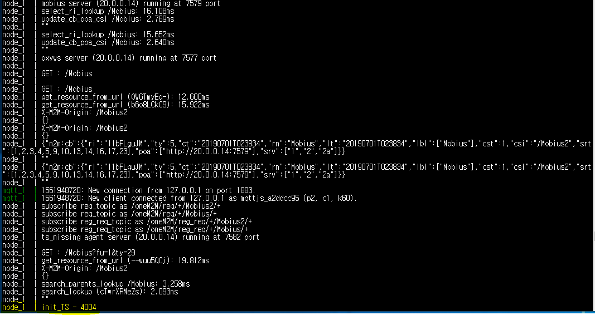

# Mobius_Docker Installation

1. Download docker

    sudo apt-get install docker.io

2. Download docker-compose

    sudo curl -L https://github.com/docker/compose/releases/download/1.21.2/docker-compose-$(uname -s)-$(uname -m) -o /usr/local/bin/docker-compose

3. Change the permission to use docker-compose
    
    sudo chmod +x /usr/local/bin/docker-compose

4. Download the docker-compose "yml" file of Mobius

    git clone https://github.com/IoTKETI/Mobius_Docker.git
    
    cd Mobius_Docker

4. Download the latest Mobius source code

    git clone https://github.com/IoTKETI/Mobius.git
    
    cd Mobius

5. Download the essential libraries required to run Mobius
    
    npm install
    
    cd ..

6. Run docker-compose 

    sudo docker-compose up
    
* Docker-compose If forcibly terminated, enter the "sudo docker-compose down" command mandatory input

# Snapshot of normal running screen 

# Docker-compose configuration details

 DB
 
    image: mysql:5.7    # Docker-Hub에 저장된 mysql Docker 이미지를 가져옵니다. 
    environment:        # mysql 환경변수 설정입니다. 
      MYSQL_ROOT_PASSWORD: dksdlfduq2
      MYSQL_ALLOW_EMPTY_PASSWORD: "yes"
      MYSQL_DATABASE: mobiusdb
    ports:    # 가상화된 독립적인 환경을 갖는 소프트웨어 이기에 HOST와 Port 매칭이 필요합니다.  "HOST:Docker-container" 
      - "3306:3306"
    network_mode: "host"  # 네트워크모드를 Host로 동일하게 동작합니다. 
    volumes:              # Host에서 필요한 라이브러리들을 가져옵니다.  이 경로에 mobiusdb.sql 파일 저장되어있습니다. 
      - ./Mobius/sql:/docker-entrypoint-initdb.d
    healthcheck:          # Docker-compose의 기능으로써 소프트웨어의 동작 여부를 체크해줍니다. 
            test: ["CMD", "mysqladmin" ,"ping", "-h", "localhost"]
            timeout: 20s
            retries: 10
            
 Mobius			
 
    image: "node:7.6"
    working_dir: /home/node/app   # Nodejs 소스코드를 형성할 가상이미지 디렉토리를 설정합니다. 
    environment:
      - NODE_ENV=production
    volumes:                   # Host의 모비우스 소스코드를 가상이미지 디렉토리로 가져옵니다.
      - ./Mobius:/home/node/app
    network_mode: "host"
    expose:
      - "8081"
    command: "node mobius"  # 완료 후 모비우스를 실행합니다. 
    depends_on:             # Mysql이 동작 한 이후 Mobius가 동작하게 됩니다. 이를 고려하지 않을 시 DB와의 딜레이로 정상적으로 실행되지 않습니다.   
            db:
                condition: service_healthy
 MQTT
 
    image: eclipse-mosquitto:latest  # Docker-Hub에 저장된 mosquitto 이미지를 가져옵니다. 
    ports:
      - 1883:1883
    network_mode: "host"
    volumes:
      - ./etc/mosquitto:/etc/mosquitto:ro
      - ./var/log/mosquitto:/var/log/mosquitto:rw
    depends_on:		    # Mysql이 동작 한 이후 mosquitto가 동작하게 됩니다. 이를 고려하지 않을 시 Mobius와의 딜레이로 정상적으로 실행되지 않습니다.   
            db:
                condition: service_healthy

## Authors

* **JongGwan An** - *Initial work* - [Cftn] (https://github.com/Cftn) (kman3212@gmail.co.kr, kman3212@keti.re.kr)

